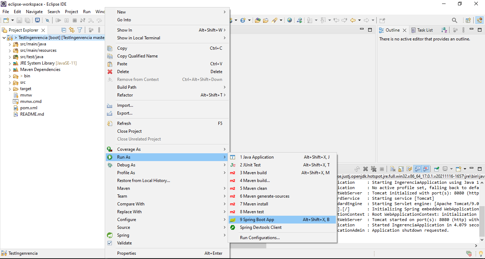

Esta es una aplicacion appi rest como prueba tecnica para Ingerencia

Contents
========
 * [Exercise Description](#problem)


## Description
Full Stack Developer Test

La aplicación es un cliente REST que apunta a una API pública.

 
Componente Backend

La aplicación Backend debe conectarse a esta API que muestra recientemente artículos publicados sobre Java en Hacker News:

●	Url API externa: http://hn.algolia.com/api/v1/search_by_date?query=java

La url externa debe ser administrada a través de anotaciones (lectura de archivo properties).
La aplicación del servidor debe definir un endpoint REST que será probado con POSTMAN.

Debes usar las siguientes tecnologías para construir la aplicación:

●	Componente Backend: 
○	Opción 1: Java Spring MVC + maven o gradle
○	Opción 2: Spring Boot 2.x + maven o gradle


## Installation

 Para correr la aplicacion en eclipse IDE.

Clonar el projecto:
```sh
git clone https://github.com/8-30/TestIngenrencia.git
```
Dentro de eclipse, abrir la ubicacion del proyecto 


Para acceder a la informacion de la api, una vez compilado el proyecto dirigirce a localhost:8080/article/getArticles

